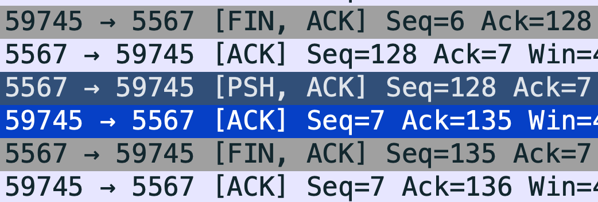

# 四次揮手

## Lab 1

步驟:

1. 啟動 Wireshark
2. 針對 lo 介面進行 capture
3. 啟動 server
4. 啟動 client

可以錄製到「四次」揮手的封包，例如:


## Lab 2

1. 在 server.js 中找到以下程式碼，並且把 `socket.write('Goodbye');` 註解掉

```js
socket.on('end', () => {
  const dt = new Date();
  socket.write('Goodbye');
  console.log(`Client disconnected at ${dt.toISOString()}`);
  socket.end();
});
```

2. 重複 Lab 1 的步驟，並且觀察封包，server 記得要重新啟動

這個實驗不但可以錄製到`四次` 揮手的封包，也可以觀察到在 client 端送出 `FIN` 後，server 端會回傳 `ACK`，但是 server 端還是可以繼續對 client 端送出訊息。


